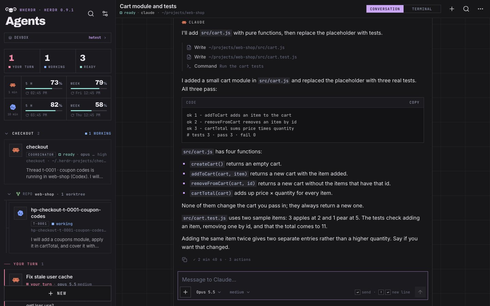
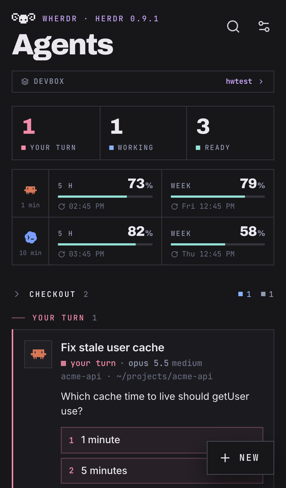
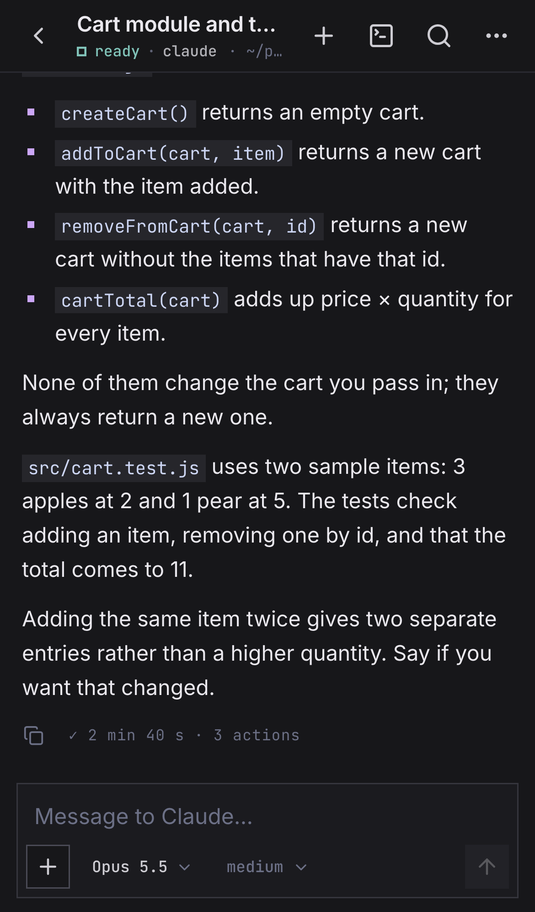
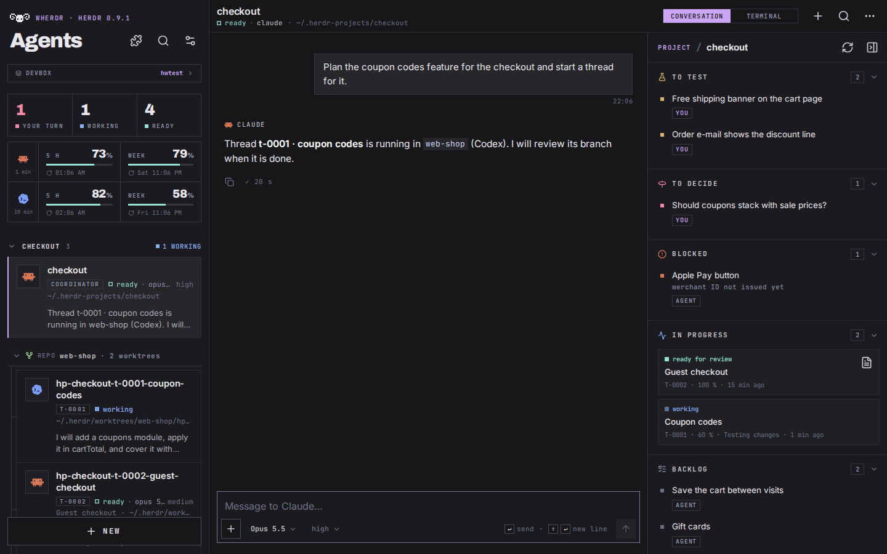
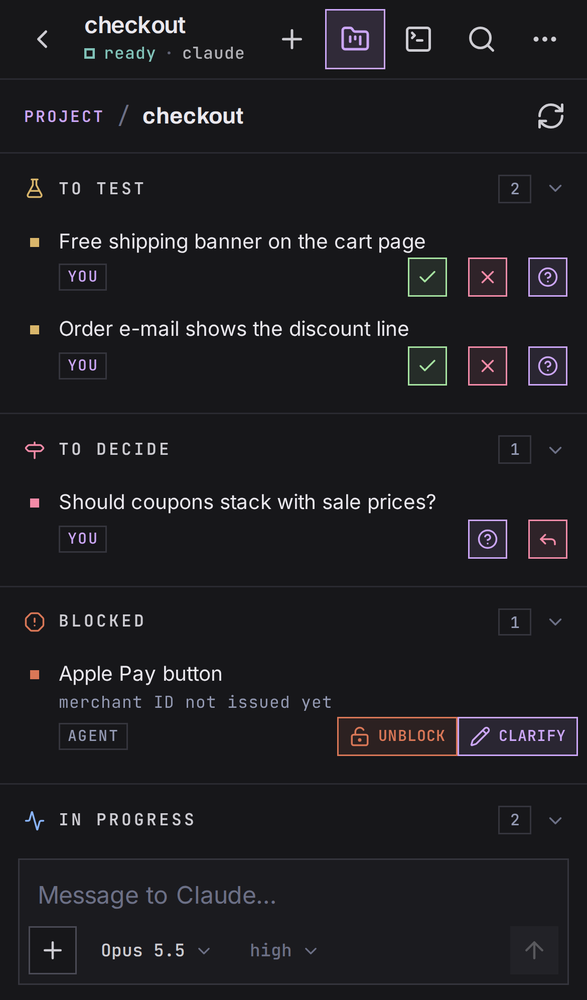

<p align="center">
  
</p>

<h1 align="center">wherdr</h1>

<p align="center"><b>A complete workspace for the coding agents running in <a href="https://herdr.dev">Herdr</a>, on your
computer and on your phone.</b></p>

## Quick start

To try it on one computer, with [Herdr](https://herdr.dev) running and Node.js 22, on macOS or
Linux (`localhost` only). For phone access, see the [recommended setup](#recommended-always-on-server--tailscale).

```sh
git clone https://github.com/afloury/wherdr.git && cd wherdr
npm ci && npm run build && npm start    # then open http://localhost:7683
```

wherdr is a small self-hosted web app that talks to the Herdr server on your machine. **On a
computer**, it can replace the Herdr terminal client day to day: your spaces, tabs and split panes
side by side, live conversations and real terminals, drag-and-drop layout, keyboard shortcuts
and a project board for herdr-projects. **On a phone**, installed as a PWA, it is the companion
that follows your agents when you are away: push notifications when an agent finishes or needs
you, one-tap answers, quick replies and offline reading.

It lists your agents live — Claude Code, Codex and the other agents Herdr recognizes — and works
on the same Herdr session `herdr` attaches to: nothing is copied, nothing runs in the cloud. Use
it on `localhost`, or from your other devices over Tailscale.

> [!WARNING]
> **wherdr is a remote shell on your machine.** Anyone who can reach it can start agents and
> run commands as your user. **Never expose it on the public Internet** (no port forwarding, no
> public reverse proxy, no tunnel). Use it on `localhost`, or from your other devices through a
> private network such as [Tailscale](https://tailscale.com). Enabling the passkey lock is
> strongly recommended. See [Security](#security).

<p align="center">
  
</p>
<p align="center"><sub>On a computer</sub></p>
<br>
<p align="center">
  
  &nbsp;&nbsp;&nbsp;&nbsp;
  
</p>
<p align="center"><sub>On a phone: the same agents, the same session.</sub></p>

*Unofficial project. Not affiliated with or endorsed by Herdr, Anthropic or OpenAI. Claude,
Claude Code, Codex and other product names are trademarks of their respective owners.*

## Contents

- [Quick start](#quick-start)
- [Features](#features)
- [How it works](#how-it-works)
- [Requirements](#requirements)
- [Installation](#installation): [which setup?](#which-setup) ·
  [always-on server + Tailscale](#recommended-always-on-server--tailscale) ·
  [one computer, no Docker](#simple-one-computer-no-docker)
- [Updating](#updating)
- [Install the app on your phone](#install-the-app-on-your-phone)
- [Configuration](#configuration)
- [Several machines (SSH)](#several-machines-ssh)
- [Claude and Codex quotas](#claude-and-codex-quotas)
- [Notifications](#notifications)
- [Works great with herdr-projects](#works-great-with-herdr-projects)
- [Herdr plugins](#herdr-plugins)
- [Security](#security)
- [Troubleshooting](#troubleshooting)
- [Contributing](#contributing) · [License](#license)

## Features

### Everywhere

- **Live agent list**, one line per Herdr space, grouped by state (your turn, working, ready),
  with a preview of each agent's last answer. When an agent asks for permission or asks a
  question, the options show on its card: **answer in one tap** without opening it.
- **Conversation view**: the agent's real transcript (Claude Code and Codex), rendered as
  Markdown, with grouped tool calls, images, timestamps, search and infinite scroll back to the
  first message. Reading a conversation never touches the terminal, so it never resizes a pane.
- **Terminal view**: the real terminal (xterm.js, WebGL or DOM renderer) with take-over.
- **Composer**: send messages while the agent works (queued, cancellable), attach or paste
  photos, run slash commands (`/compact`, `/clear`, `/context`, `/usage`…) and see the output
  of local commands. Stop button while the agent works.
- **Model and effort pickers** for Claude Code and Codex. Changes apply **to the current
  session only**; wherdr never changes your default model.
- **New agent**: pick an installed agent (or a plain terminal), a folder, optionally a separate
  Git **worktree** and branch, resume the last conversation, and queue a first message.
- **Changes view**: Git status and diff of an agent's working folder; worktree management.
- **Several machines**: agents of the SSH machines registered in Herdr (`herdr machine add`)
  appear in their own section; everything works the same on a remote agent.
- **Named Herdr sessions**, **quotas** (remaining Claude and Codex usage limits), **Herdr plugin
  actions** in the menus, **passkey lock** (Face ID, Touch ID, Windows Hello, Android…).
- **Themes**: herdr.dev (default) and Herdr's built-in themes, or follow your Herdr theme.
  **English and French** interface.

### On a computer

- **Split panes, live**: a tab with several panes is drawn with Herdr's real layout; every pane
  shows its conversation or terminal live, and the one you click becomes interactive.
- **Rearrange the layout**: drag a pane onto another to move it, drag a divider to resize
  (arrow keys work on a focused divider); changes go to Herdr itself.
- **Spaces and tabs**: sidebar with every space, tabs at the top, active tab remembered per space.
- **Keyboard shortcuts**: `Ctrl/⌘+K` global search across agents and conversations,
  `Alt+Shift+arrows` to swap the current pane with its neighbour,
  `Ctrl/⌘+Alt+arrows` to move focus to the neighbouring pane in a side-by-side tab, `Esc` to close dialogs,
  `Enter` to send and `Shift+Enter` for a new line.
- **Project board** for [herdr-projects](#works-great-with-herdr-projects): coordinator and threads grouped
  under their project, and a side panel with the project's task lists (to test, to decide,
  blocked, in progress, backlog) and one-click replies to the coordinator.
- **Settings** in a sidebar, with desktop-only options such as the content width.

### On a phone

- **Installable app (PWA)** on iPhone and Android, with safe-area and keyboard handling.
- **Web Push notifications** when an agent finishes or needs you (with its question), and for
  `herdr notification show` (plugins, scripts).
- **Quick replies**: answer permissions and questions in one tap from the agent list.
- **Split tabs on a small screen**: a plan of the tab's panes in Herdr's proportions, then each
  pane full screen with a mini-map and swipe to its neighbours.
- **Terminal key bar** (Esc, Enter, arrows, Shift+Tab, Ctrl+C…) and touch scrolling.
- **Offline reading** of the last known state and of recently opened conversations.

## How it works

```
phone / laptop ──private network──> HTTPS (tailscale serve, private proxy)
                                        │
                                        ▼
                             wherdr (Nitro server, 127.0.0.1:7683)
                               ├─ Herdr API socket     ~/.config/herdr/herdr.sock
                               ├─ Herdr client socket  (notifications, passive client)
                               ├─ herdr terminal session control <pane>   (terminal view)
                               ├─ transcripts          ~/.claude, ~/.codex (read only)
                               └─ ssh -M <machine>     (other machines, optional)
```

wherdr runs on the same machine as the Herdr server (the "server" below). It uses Herdr's local
socket API and CLI, reads the agents' transcript files, and serves a client-only Nuxt app. Data
it keeps (VAPID keys, push subscriptions, passkeys, recent folders) lives in `data/`.

Built with Nuxt 4, Nuxt UI 4, Tailwind 4 and TypeScript; the Herdr gateway (API, WebSockets,
Web Push, lock) runs in Nitro.

## Requirements

- **Herdr ≥ 0.9.1** running on the server (`herdr` or `herdr server`), with its Claude Code /
  Codex integrations installed if you use them (`herdr integration install claude|codex`).
- **Linux or macOS** server with either **Docker** (Compose v2) or **Node.js 22**.
  The Docker image is for Linux servers (tested on a Raspberry Pi too). **On macOS, run without
  Docker**: Docker Desktop cannot reach Herdr's Unix socket on the host.
- **HTTPS** to use passkeys, push notifications and the installable app from another device.
  Browsers only allow them on `https://` or `http://localhost`. The easiest way is
  [`tailscale serve`](https://tailscale.com/kb/1312/serve); a reverse proxy **reachable only
  from your private network** with a valid certificate also works.

## Installation

### Which setup?

| | **Always-on server + Tailscale** (recommended) | **One computer, no Docker** |
| --- | --- | --- |
| Runs on | A machine that never sleeps: Raspberry Pi, mini-PC, home server, private VPS (Linux, Docker) | The computer you work on (macOS or Linux, Node.js 22) |
| Reach it from | Your phone and every computer on your tailnet | That computer only (`http://localhost:7683`) |
| Installable app, push notifications, passkeys | Yes (private HTTPS from `tailscale serve`) | Desktop browser only; no phone access |
| Other machines (a Mac, a laptop…) | Added in Herdr over SSH, shown in wherdr | Also possible, but they are only reachable while this computer is awake |

Both setups use the same app. You can start with the second one and move to the first later.

### Recommended: always-on server + Tailscale

Your agents keep running when your laptop is closed, and you follow them from your phone.
wherdr stays on your private network: it is **never published on the Internet**.

**1. Herdr on the server.** Install [Herdr](https://herdr.dev) (≥ 0.9.1) and start it
(`herdr` or `herdr server`), with the integrations of the agents you use
(`herdr integration install claude|codex`).

**2. wherdr with Docker** (Linux, Compose v2):

```sh
git clone https://github.com/afloury/wherdr.git
cd wherdr
cp .env.example .env
```

Edit `.env` (every value has a default; `HOST_HOME` defaults to your `$HOME`):

| Variable | Example | Meaning |
| --- | --- | --- |
| `HOST_HOME` | `/home/alice` | Your home folder on the server (default: `$HOME`). Mounted at the same path, read-only. |
| `PUID` / `PGID` | `1000` | Your user and group IDs (`id -u`, `id -g`). |
| `PORT` | `7683` | Listening port, published on `127.0.0.1` only. |
| `APP_URL` | `https://server.example.ts.net:7683/` | Private HTTPS address of the app (step 3; also used as the Web Push contact and an allowed host). Use `http://localhost:7683/` for local testing. |
| `HOST_LABEL` | `server` | Name of this machine in the app. |
| `TZ` | `Europe/Paris` | Time zone for timestamps and logs. |
| `WHERDR_UPDATE_CHECK` | `off` | Disable the daily check for a new release (default `on`). |

Create the bind-mount folders **before** starting Compose, as your own user. Otherwise Docker
may create missing host folders as root, leaving the container unable to write to them.

```sh
mkdir -p data "$HOME/.config/herdr" "$HOME/.local/state/herdr/client" "$HOME/.cache/herdr-web" \
  "$HOME/.herdr-projects"
docker compose up -d          # pulls ghcr.io/afloury/wherdr (arm64 and amd64)
docker compose logs -f        # optional: follow the logs and find the first-passkey token
```

The container runs as your user and mounts your home folder **read-only**, except
`~/.config/herdr` (Herdr sockets), `~/.local/state/herdr/client` (machine names),
`~/.cache/herdr-web` (uploaded photos, quotas) and `~/.herdr-projects` (herdr-projects
projects, see [Works great with herdr-projects](#works-great-with-herdr-projects)). It uses the
server's own `herdr` binary, so the client and the server always stay on the same version.

The repository is only needed for `docker-compose.yml` and `.env`: the image is prebuilt and
published for each release. To build it from source instead, see [Updating](#updating).
**Custom icons** (optional): copy
`docker-compose.override.example.yml` to `docker-compose.override.yml` and put your icons in
`branding/` (both untracked).

**3. Private HTTPS with Tailscale.** Install [Tailscale](https://tailscale.com) on the server,
your phone and your computers, on the same tailnet, with
[MagicDNS and HTTPS certificates](https://tailscale.com/kb/1153/enabling-https) enabled. Then,
on the server:

```sh
tailscale serve --bg --https=7683 http://127.0.0.1:7683
# → https://<machine>.<tailnet>.ts.net:7683/   (e.g. https://server.example.ts.net:7683/)
```

Tailscale Serve listens on HTTPS port 7683 of your tailnet name, with a valid certificate, and
forwards to wherdr's local HTTP port. Only devices of your tailnet can reach it. Put that address
in `APP_URL` in `.env`, then `docker compose up -d` again.

**Why HTTPS matters.** Browsers only allow three things on `https://` (or on `localhost` itself):

- **installing the app** on the home screen (PWA) on iPhone and Android;
- **push notifications** (on iOS, only in the installed app);
- **passkeys** for the lock screen (Face ID, Touch ID, Windows Hello, Android).

**4. On the phone:** open the address, [install the app](#install-the-app-on-your-phone), then
Settings → **Enable notifications**. **On the computer:** use the same address in a browser; the
desktop layout can replace the Herdr terminal client for daily work.

**5. Passkey lock** (recommended, optional): Settings → Security → **Enable passkey lock**. The
first passkey asks for a bootstrap token, printed in the server logs (`docker compose logs`);
it changes on each restart and is only needed for that first passkey. Add a passkey on each of
your devices after that. Without one, every device of your tailnet can control your agents.

**6. More machines** (optional): register your other computers in Herdr over SSH
(`herdr machine add`, see [Several machines (SSH)](#several-machines-ssh)). Their agents show
in wherdr in their own section, and everything works the same on them. The machine menu also has
**Keep awake**, which stops a Mac (`caffeinate`) or a Linux machine (`systemd-inhibit`) from
sleeping for an hour, four hours, the evening or until turned off.

> [!CAUTION]
> Never publish wherdr on the Internet: no port forwarding on your router, no public reverse
> proxy, no Cloudflare Tunnel or ngrok, no `tailscale funnel`. Use `tailscale serve`, which stays
> inside your tailnet. See [Security](#security).

### Simple: one computer, no Docker

The quickest way to try it, and the way to run wherdr **on macOS**: Docker Desktop cannot reach
Herdr's Unix socket on the host. With Herdr running, Git and Node.js 22 on the same machine:

```sh
git clone https://github.com/afloury/wherdr.git
cd wherdr
npm ci
npm run build
npm start                  # listens on 127.0.0.1:7683
```

Open `http://localhost:7683` in a browser on that computer: the desktop layout, passkeys and the
installable app work there, since browsers treat `localhost` as secure. There is no phone access
and no push notification in this setup; for that, use the recommended setup (or publish this
instance with `tailscale serve` as above and start it with
`APP_URL=https://server.example.ts.net:7683/ npm start`).

Run it as the user who runs Herdr. It uses `$HOME` and `$HOME/.local/bin/herdr`, or `herdr` from
the `PATH` (Homebrew); set `HERDR_BIN` otherwise. `DATA_DIR` holds passkeys, push data and recent
folders (default `./data`). `npm start` listens on `127.0.0.1` (`HOST`) and port `7683` (`PORT`).
The first-passkey bootstrap token is printed in its output. Keep the process running with your
usual service manager (systemd user unit, launchd, tmux…).

With `APP_URL` empty or `http://localhost:7683/`, wherdr starts normally but disables Web Push
and logs a warning.

## Updating

wherdr checks the latest GitHub release at most once a day (an anonymous request to
`api.github.com`, nothing is sent) and shows a small **“wherdr X.Y.Z is available”** banner on the
home screen and in Settings › About, with the release notes and the exact command for your setup.
Hide it until the next version with ×. Set `WHERDR_UPDATE_CHECK=off` to disable the check. The
installed version is shown in Settings › About.

| Setup | Update command (in the wherdr folder) |
| --- | --- |
| Docker, published image (default) | `docker compose pull && docker compose up -d` |
| Docker, built from source | `git pull && docker compose -f docker-compose.yml -f docker-compose.build.yml up -d --build` |
| No Docker | `git pull && npm ci && npm run build`, then restart wherdr |

Also run `git pull` now and then with the published image: it brings the latest
`docker-compose.yml` and `.env.example`.

**Build from source.** `docker-compose.build.yml` builds the image locally (`herdr-web:local`)
instead of pulling it: add `-f docker-compose.yml -f docker-compose.build.yml` to every
`docker compose` command (and `-f docker-compose.override.yml` if you use one). A build needs
about 2 GB of free memory.

**Automatic updates** (optional). [Watchtower](https://containrrr.dev/watchtower/) can pull new
images and restart the container for you:

```sh
docker run -d --name watchtower --restart unless-stopped \
  -v /var/run/docker.sock:/var/run/docker.sock \
  containrrr/watchtower --cleanup --schedule "0 0 4 * * *" herdr-web
```

Pin a version instead of `latest` with `WHERDR_IMAGE=ghcr.io/afloury/wherdr:1.2.0` in `.env`.

## Install the app on your phone

The app must be served over HTTPS (see [Requirements](#requirements)).

- **iPhone / iPad** (iOS 16.4 or later): open the address in **Safari** → Share →
  **Add to Home Screen**. Open wherdr from the home screen, then Settings → **Enable
  notifications**. On iOS, push notifications only work in the installed app.
- **Android**: open the address in **Chrome** → menu → **Install app** (or Add to Home
  screen), then Settings → **Enable notifications**.
- **Computer**: just use the address in a browser; Chrome and Edge can also install it.

Then Settings → Security → **Enable passkey lock** on each device.

## Configuration

All settings are environment variables (`.env` with Docker).

| Variable | Default | Meaning |
| --- | --- | --- |
| `PORT` | `7683` | Listening port. |
| `HOST` | `127.0.0.1` (`npm start`) | Listening address without Docker. Keep it on loopback. |
| `HOST_LABEL` | server hostname (`wherdr` in Docker) | Name of this machine in the app (can be renamed in the app). |
| `APP_URL` | *(empty)* | App address and allowed host; a valid HTTPS URL enables Web Push. HTTP, empty or invalid values disable Web Push with a warning. |
| `HERDR_WEB_ALLOWED_HOSTS` | *(empty)* | Additional hostnames or IP addresses allowed to open the app, comma-separated. |
| `PASSKEY_USER` | `wherdr` | User name stored with the passkeys. |
| `DATA_DIR` | `./data` | VAPID keys, push subscriptions, passkeys, recent folders. |
| `HERDR_BIN` | `~/.local/bin/herdr`, else `herdr` in `PATH` | Herdr binary. |
| `HERDR_WEB_SESSION` | *(default session)* | Named Herdr session to drive. Not `HERDR_SESSION`, which Herdr reads itself. |
| `AGENT_KINDS` | all known agents | Agents offered in **New** (only installed ones are shown). |
| `HERDR_WEB_MACHINES` | `on` | `off` to ignore the SSH machines registered in Herdr. |
| `HERDR_WEB_SELF_HOSTS` | | Other names / IPs of this machine, comma-separated (profiles pointing to it are ignored). |
| `HERDR_WEB_REMOTE_SESSION` | | Herdr session to use on every remote machine instead of the profile's. |
| `HERDR_WEB_HERDR_NOTIFICATIONS` | `on` | `off` to stop relaying `herdr notification show` as push. |
| `UPLOAD_DIR` | `~/.cache/herdr-web/uploads` | Where photos sent to agents are stored (deleted after 7 days). |
| `TZ` | `UTC` | Time zone. |

In the app, **Settings** holds per-device preferences: language, theme, notifications, terminal
text size and renderer, typing effect, what the home screen shows, and the passkey lock.

## Several machines (SSH)

wherdr also shows the agents of the **SSH machines registered in Herdr** — the ones the Herdr
terminal client shows in its sidebar. It opens one SSH master connection per machine, forwards
the remote Herdr socket through it, and reads transcripts and files over the same connection.

Requirements on the remote machine: the **same Herdr version** (`herdr --version`), its server
running, and key-based SSH access from the server. Example, on the server:

```sh
ssh-keygen -t ed25519 -f ~/.ssh/wherdr_ed25519 -N ''
cat >> ~/.ssh/config <<'CFG'
Host laptop
  HostName laptop
  User alice
  IdentityFile ~/.ssh/wherdr_ed25519
  IdentitiesOnly yes
CFG
ssh-copy-id -i ~/.ssh/wherdr_ed25519 laptop
ssh laptop true                            # accept the host key once
herdr machine add laptop --label Laptop    # see `herdr machine --help`
```

wherdr picks it up within 30 seconds; `herdr machine rename|disable|remove` work the same way.
Machines can also be renamed from the app (machine menu → Options).

With Docker, the image includes `openssh-client` and reads `~/.ssh` through the read-only home
mount. At startup the container creates its user with your `PUID`/`PGID` and `HOST_HOME` as its
home folder, so ssh finds `~/.ssh` there.

## Claude and Codex quotas

The home screen shows what is left of the Claude and Codex usage limits (5-hour window and
week, with reset times), for every online machine.

- **Codex**: nothing to do, Codex writes its limits in its session files. Machines on different
  Codex accounts get one block each (told apart by a short hash of the account ID found in the
  session files; `~/.codex/auth.json` is never read).
- **Claude Code** only gives them to its status line. On each machine, install wherdr's
  invisible status line (it displays nothing, and chains to your existing status line if you
  have one):

  ```sh
  sh scripts/install-claude-statusline.sh
  ```

  The app offers the same thing: a banner "Claude quotas not configured" with **Install** (runs
  it over SSH on a remote machine) and **Copy command**. Quotas show after the next exchange with
  a Claude agent. The status line stores the limits in `~/.cache/herdr-web/claude-status.json`
  and a short hash of the account ID (never a token or email) to tell accounts apart.

  **New machine**: run `sh scripts/install-claude-statusline.sh` on it once (or click **Install** in
  the banner), then send a message to any Claude agent there; its quotas appear on the home screen.

## Notifications

With notifications enabled on a device, wherdr sends a Web Push when an agent goes from working
to **blocked** (with its question and options) or to **done** (with the start of its answer).
There is no push for the agent currently on screen. Settings → Notifications lets each device
choose between all agents and main agents only (herdr-projects threads are muted by default).

**Do not disturb** (top of Settings → Notifications) stops every push, for this device or for all
devices, for 1 hour, until 8 am or until turned back on. The server applies it before sending and
keeps it across restarts (`data/quiet.json` for all devices). While it is on, a crossed-out bell
next to Settings on the home screen turns it off in one tap.

wherdr also relays custom notifications sent with `herdr notification show` (plugins, scripts).
To receive them it connects to Herdr's client socket as a **passive** client: it never becomes
the foreground client and never resizes anything. Side effects: with wherdr connected,
`notification show` reports `shown: true` even with no terminal attached, and an empty session
gets a default workspace, as with any attached client.

## Works great with herdr-projects

[herdr-projects](https://github.com/eliasstravik/herdr-projects) is a Herdr plugin that runs a
project as one **coordinator** conversation and parallel **threads**, each in its own Git
worktree. It is optional; with it installed, wherdr adds:

- **Project groups** in the agent list: the coordinator first, its threads indented under it,
  grouped by repository (`Repo web-shop · 2 worktrees`), with their thread number and state.
- **Project panel** next to the coordinator (a side panel on a computer, a tab on a phone). It
  reads the project's `TASKS.md` and shows its lists — **To test**, **To decide**, **Blocked**,
  **In progress**, **Backlog** and **Done** — with the open threads live (state, progress,
  report) and resolved threads under Done. Each list has its buttons, which send a ready-made
  message to the coordinator: **Confirm** / **Problem** / **Question** on things to test, **Question** / **Answer** on
  decisions, **Launch** or **Clarify** on backlog items, **Unblock** on blocked ones.
- **Settings → Plugins → herdr-projects**: install status per machine, the `TASKS.md` convention,
  a template and the coordinator rules to copy.
- **New project** from the plugin actions of an agent's menu, with the same machine and folder
  picker as **New agent** (see [Herdr plugins](#herdr-plugins)).

<p align="center">
  
</p>
<p align="center">
  
</p>
<p align="center"><sub>A coordinator with its Project panel, on a computer and on a phone (demo data).</sub></p>

## Herdr plugins

Actions declared by the plugins installed on a machine (`herdr plugin install|link`) appear in
the menus: workspace / tab / pane actions in the agent menu, global actions in the machine menu.
wherdr always passes the agent's pane explicitly. It asks for confirmation before running an
action, except for actions that only show or check something (list, show, status, doctor…).
Actions that open a plugin panel open it in the attached Herdr terminal client, not on the phone.

**herdr-projects** actions that ask for input (New project, continue this workspace as a
project, open, pause, resume) are run by wherdr itself as `herdr-projects` commands, because
Herdr's API cannot pass them arguments. **New project** picks its repository like **New agent**
picks a folder: the machine (when the project is created from this machine, a repository on an
SSH machine is passed as `PATH@MACHINE`), a folder browser and recent folders. It suggests the
root of the current space's Git repository (nothing outside a repository, never your home
folder itself), offers the root when you pick a subfolder, and names the project after the
repository.
With Docker, these commands write to the projects folder, so `docker-compose.yml` mounts
`~/.herdr-projects` read-write. If you set another `root` in
`~/.config/herdr-projects/config.toml`, mount that folder instead (same path on both sides);
otherwise wherdr reports that the home folder is read-only. Check setup only reads; the other
actions (Configure…) run on the host through Herdr, as in the terminal client. When no herdr-projects
ticker is running yet, the one these commands start inside the container is stopped right away;
the next `herdr-projects` command run on the host (a coordinator starting a thread, Herdr
starting) starts it there.

## Security

wherdr drives Herdr, so **it can run anything as your user**. Docker does not change that: the
container talks to the Herdr server running on the host.

- It listens on `127.0.0.1` only. Reach it from other devices **only through a private
  network** (Tailscale or equivalent). Never add a public route (port forwarding, public reverse
  proxy, Cloudflare Tunnel, ngrok…).
- Requests are accepted only for `localhost`, loopback addresses, the runtime's hostname, the
  hostname in `APP_URL`, and the runtime's network interface addresses (those of the container
  with Docker). Add other private names or IP addresses to `HERDR_WEB_ALLOWED_HOSTS`
  (comma-separated) before using them. An unlisted name returns HTTP 403 (`host` / "Host not
  allowed"); add it to `HERDR_WEB_ALLOWED_HOSTS`, then restart wherdr. This host check also
  applies to WebSockets.
- **Passkey lock** (Settings → Security, recommended): once a passkey is registered, the API,
  images, photos and WebSockets require an unlocked session (signed HttpOnly cookie, 12 hours).
  Turning the lock off invalidates every session. Lost passkey: delete `data/auth.json` on the
  server; the app is open again to whoever can reach it.
- Without a passkey, **anyone who can reach the address can control your agents**: every device
  on your tailnet, and every user of your tailnet if you share it.
- Writes require `Content-Type: application/json` (or `image/*` for photos) and an `Origin`
  matching the host, WebSockets included. API reads sent from another site (links, images,
  `no-cors` fetches, reported by the browser's `Sec-Fetch-Site`) are refused too.
- A strict Content Security Policy limits scripts to the app's own origin and hashed inline
  scripts, and connections to that origin and its WebSockets. It also blocks embedded objects
  and framing.
- wherdr never changes your agents' global settings: model and effort changes are for the
  current session only.

See [SECURITY.md](SECURITY.md) to report a vulnerability.

## Troubleshooting

- **"The Herdr server is not responding"**: start Herdr on the server (`herdr` or
  `herdr server`). With Docker, check that `HOST_HOME` and `PUID` match your user.
- **No conversation, only the terminal**: the agent was started before the Herdr integration
  was installed, or it is not Claude Code / Codex. Install the integration
  (`herdr integration install claude|codex`) and start a new agent.
- **Passkeys or notifications unavailable**: the page must be served over HTTPS (or
  `localhost`). On iPhone, notifications need the app installed on the home screen.
- **HTTP 403 when opening the app through another name**: add that private hostname or IP
  address to `HERDR_WEB_ALLOWED_HOSTS`, or use the hostname in `APP_URL`, then restart wherdr.
- **Remote machine offline**: `docker compose logs | grep machine` shows its state. Test SSH as
  wherdr does, from the container:
  `docker compose exec herdr-web ssh -o BatchMode=yes laptop '~/.local/bin/herdr status server'`.
  - `Could not resolve hostname`: container DNS (use the full name in `HostName`);
  - `Permission denied (publickey)` / `Host key verification failed`: key or `known_hosts`
    (run `ssh laptop true` once on the server);
  - `Bad owner or permissions`: `~/.ssh/config` must belong to you and not be group-writable.
- **Claude says "Not logged in" on a Mac** whose Herdr server was started over SSH: the macOS
  keychain is locked in SSH sessions. Start the Herdr server from a terminal on the Mac.
- **Quotas missing**: see [Claude and Codex quotas](#claude-and-codex-quotas).
- **iPhone layout cut at the bottom** after changing the status bar style: reinstall the home
  screen icon (iOS reads this setting at install time).

## Contributing

See [CONTRIBUTING.md](CONTRIBUTING.md). Changes are listed in [CHANGELOG.md](CHANGELOG.md).

Every commit is public, so a leak check runs on the files tracked or staged in git:

```sh
cp .leak-patterns.example .leak-patterns   # git-ignored: list your own names, hosts, e-mails, IPs
npm run check:leaks                        # gitleaks (if installed) + your forbidden patterns
npm run hooks:install                      # optional: same check on staged files before each commit
```

In a linked worktree (`git worktree add`), the check falls back to the main checkout's
`.leak-patterns`, and the hook runs there too since `core.hooksPath` lives in the shared git config.

Matches are printed as `file:line`, truncated so the secret itself is never shown, and the command
exits with a non-zero code. Install [gitleaks](https://github.com/gitleaks/gitleaks) to also catch
tokens and keys.

## License

[MIT](LICENSE). The embedded font subsets keep their own licenses (`app/assets/fonts/`).
